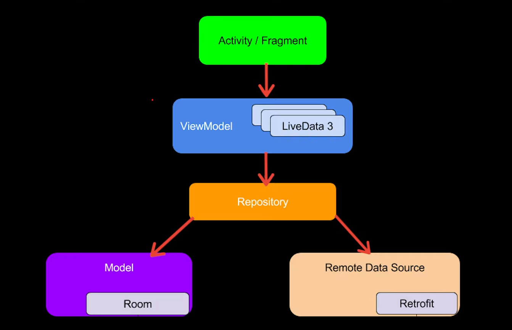

# mvvmNews Android App

    

**Author:** [Shivdatt Jangam](https://www.linkedin.com/in/shivdatt-jangam-96b814254/)

# Features

- **MVVM Architecture**: Utilizes the Model-View-ViewModel architectural pattern for better separation of concerns and maintainability.
- **Room Persistence Library**: Implements local database storage with Room for efficient data handling and offline access.
- **Kotlin Coroutines**: Harnesses the power of Kotlin Coroutines for asynchronous and non-blocking programming, ensuring smoother user experience.
- **API Integration with Retrofit and OkHttp**: Seamlessly integrates with the NewsAPI.org using Retrofit and OkHttp.
- **Swipe Gestures**: Implements intuitive swipe gestures for saving and deleting news articles, enhancing user interaction and experience.

# Model

    

# Contributors

- **Shivdatt Jangam**: Lead developer ([GitHub](https://github.com/shivdatt1999))
- **Special Thanks**: [Philip Lackner](https://www.youtube.com/@PhilippLackner) 

